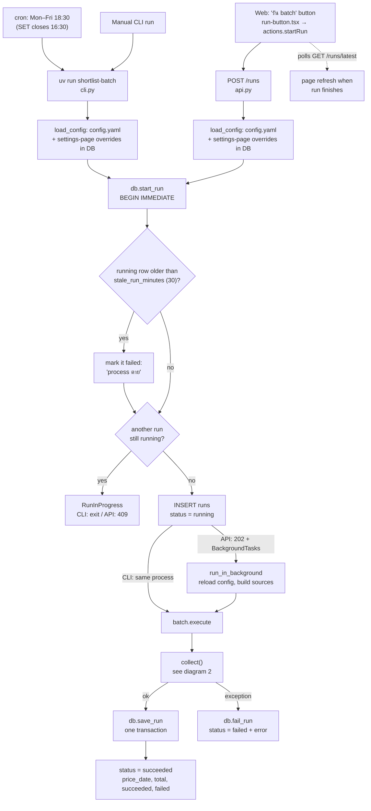
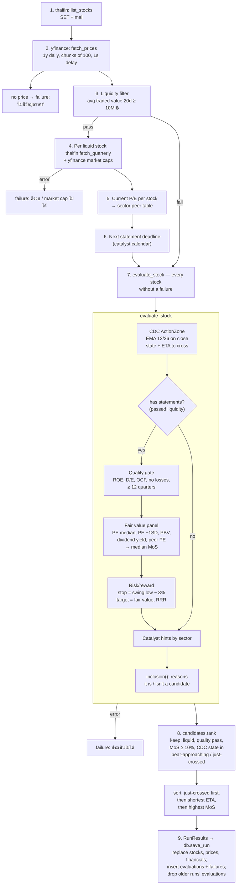
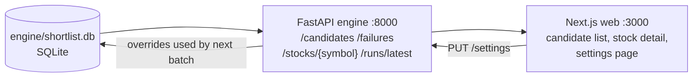

# Batch flow

## 1. When the batch runs

```mermaid
flowchart TD
    cron["cron: Mon–Fri 18:30<br/>(SET closes 16:30)"] --> cli["uv run shortlist-batch<br/>cli.py"]
    manual["Manual CLI run"] --> cli
    btn["Web: 'รัน batch' button<br/>run-button.tsx → actions.startRun"] --> post["POST /runs<br/>api.py"]

    cli --> cfg1["load_config: config.yaml<br/>+ settings-page overrides in DB"]
    post --> cfg2["load_config: config.yaml<br/>+ settings-page overrides in DB"]

    cfg1 --> start["db.start_run<br/>BEGIN IMMEDIATE"]
    cfg2 --> start

    start --> stale{"running row older than<br/>stale_run_minutes (30)?"}
    stale -- yes --> markdead["mark it failed:<br/>'process ตาย'"] --> busy
    stale -- no --> busy{"another run<br/>still running?"}
    busy -- yes --> reject["RunInProgress<br/>CLI: exit / API: 409"]
    busy -- no --> insert["INSERT runs<br/>status = running"]

    insert -->|CLI: same process| exec["batch.execute"]
    insert -->|API: 202 + BackgroundTasks| bg["run_in_background<br/>reload config, build sources"] --> exec

    exec --> collect["collect()<br/>see diagram 2"]
    collect -->|ok| save["db.save_run<br/>one transaction"]
    collect -->|exception| fail["db.fail_run<br/>status = failed + error"]
    save --> done["status = succeeded<br/>price_date, total, succeeded, failed"]

    btn -.->|polls GET /runs/latest| poll["page refresh when<br/>run finishes"]
```

## 2. What `collect()` does, step by step

```mermaid
flowchart TD
    A["1. thaifin: list_stocks<br/>SET + mai"] --> B["2. yfinance: fetch_prices<br/>1y daily, chunks of 100, 1s delay"]
    B --> B1["no price → failure:<br/>'ไม่มีข้อมูลราคา'"]
    B --> C["3. Liquidity filter<br/>avg traded value 20d ≥ 10M ฿"]

    C -->|pass| D["4. Per liquid stock:<br/>thaifin fetch_quarterly<br/>+ yfinance market caps"]
    C -->|fail| E
    D -->|error| D1["failure: ดึงงบ / market cap ไม่ได้"]
    D --> P["5. Current P/E per stock<br/>→ sector peer table"]
    P --> N["6. Next statement deadline<br/>(catalyst calendar)"]
    N --> E["7. evaluate_stock — every stock<br/>without a failure"]

    subgraph EV["evaluate_stock"]
        direction TB
        E1["CDC ActionZone<br/>EMA 12/26 on close<br/>state + ETA to cross"]
        E2{"has statements?<br/>(passed liquidity)"}
        E3["Quality gate<br/>ROE, D/E, OCF, no losses,<br/>≥ 12 quarters"]
        E4["Fair value panel<br/>PE median, PE −1SD, PBV,<br/>dividend yield, peer PE<br/>→ median MoS"]
        E5["Risk/reward<br/>stop = swing low − 3%<br/>target = fair value, RRR"]
        E6["Catalyst hints by sector"]
        E7["inclusion(): reasons<br/>it is / isn't a candidate"]
        E1 --> E2
        E2 -- yes --> E3 --> E4 --> E5 --> E6
        E2 -- no --> E6
        E6 --> E7
    end

    E --> EV
    EV -->|error| E8["failure: ประเมินไม่ได้"]
    EV --> R["8. candidates.rank<br/>keep: liquid, quality pass,<br/>MoS ≥ 10%, CDC state in<br/>bear-approaching / just-crossed"]
    R --> S["sort: just-crossed first,<br/>then shortest ETA,<br/>then highest MoS"]
    S --> O["9. RunResults → db.save_run<br/>replace stocks, prices, financials;<br/>insert evaluations + failures;<br/>drop older runs' evaluations"]
```

## 3. Who reads the results

```mermaid
flowchart LR
    db[("engine/shortlist.db<br/>SQLite")] --> api["FastAPI engine :8000<br/>/candidates /failures<br/>/stocks/{symbol} /runs/latest"]
    api --> web["Next.js web :3000<br/>candidate list, stock detail,<br/>settings page"]
    web -->|PUT /settings| api
    api -->|overrides used by next batch| db
```
